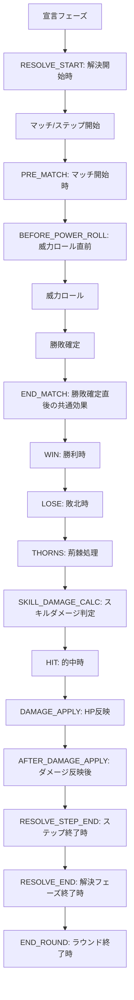

# 25. Select/Resolve Timing Normalization Plan

**最終更新日**: 2026-06-30  
**対象バージョン**: Planned  
**対象機能**: Select/Resolve 専用進行におけるスキル効果タイミング整理

---

## 1. 目的

今後の正式な戦闘進行を Select/Resolve 方式に統一し、旧通常マッチ/旧広域マッチ由来の効果タイミング差を解消する。

特に `END_MATCH` の意味を「マッチの全処理終了後」ではなく、「勝敗確定直後のマッチ共通タイミング」として明文化し、`WIN` / `LOSE` / `HIT` / `AFTER_DAMAGE_APPLY` / `RESOLVE_END` との役割を分離する。

---

## 2. 前提

- 正式なゲーム進行は Select/Resolve 方式のみを対象にする。
- 旧通常マッチ/旧広域マッチの挙動は互換用・参照用とし、新仕様の設計基準にはしない。
- `END_MATCH` という timing 名は残す。
- `END_MATCH` は「勝敗確定直後」であり、「HP反映や後処理まで終わった後」ではない。
- HP反映後の効果は `AFTER_DAMAGE_APPLY`、解決ステップ終了時は `RESOLVE_STEP_END`、解決フェーズ全体の終了時は `RESOLVE_END` に分離する。

---

## 3. 標準タイムライン案

---

## 4. Timing 定義案

| timing | 役割 | 主な用途 |
|---|---|---|
| `RESOLVE_START` | 解決フェーズ開始時 | 全体開始時の非公開準備、解決前の状態確定 |
| `PRE_MATCH` | マッチ開始時 | 威力ロール前の封印、補正、事前付与 |
| `BEFORE_POWER_ROLL` | 威力ロール直前 | 実ロール直前に確定する威力補正 |
| `END_MATCH` | 勝敗確定直後の共通効果 | 勝敗を問わず、後続の勝利/敗北/ダメージ処理に影響させる効果 |
| `WIN` | マッチ勝利時 | 勝者への報酬、勝者起点の付与 |
| `LOSE` | マッチ敗北時 | 敗者へのペナルティ、敗者起点の付与 |
| `HIT` | スキルダメージ判定後、HP反映前の的中時 | 的中時付与、命中した場合のみ発生する追加効果 |
| `AFTER_DAMAGE_APPLY` | HP反映後 | 実際にHPが減った後の反応、死亡/離脱に近い処理 |
| `RESOLVE_STEP_END` | 1ステップ終了時 | マッチ単位の表示完了、ステップ後処理 |
| `RESOLVE_END` | 解決フェーズ終了時 | 全ステップ完了後の後処理 |
| `END_ROUND` | ラウンド終了時 | ラウンド終了効果、継続ダメージ、持続更新 |

`THORNS` と `SKILL_DAMAGE_CALC` は JSON timing としては公開せず、内部処理名に留める。`THORNS` は荊棘のシステム処理、`SKILL_DAMAGE_CALC` は亀裂などを参照する内部境界名として扱う。

---

## 5. END_MATCH の正式定義

`END_MATCH` は、マッチの勝敗が確定した直後に発動する共通 timing とする。

この timing は以下の性質を持つ。

- 勝者/敗者の区別が必要な効果は `WIN` / `LOSE` を使う。
- 勝敗を問わず「このマッチのダメージ計算より前に入れたい効果」は `END_MATCH` を使う。
- `END_MATCH` で付与された状態・バフは、同じマッチ内の後続処理に影響してよい。
- `END_MATCH` は HP 反映後ではない。HP 反映後の効果は `AFTER_DAMAGE_APPLY` を使う。
- `END_MATCH` は解決フェーズ全体の終了ではない。全体終了は `RESOLVE_END` を使う。

---

## 6. 代表状態の扱い

### 6.1 亀裂

亀裂は「いつ付与されたか」で同マッチ内のダメージ寄与が変わる。

| 付与 timing | 同マッチのスキルダメージ判定に寄与するか |
|---|---|
| `PRE_MATCH` | 寄与する |
| `END_MATCH` | 寄与する |
| `WIN` | 寄与する |
| `LOSE` | 寄与する |
| `HIT` | 寄与しない |
| `AFTER_DAMAGE_APPLY` | 寄与しない |

原則:

- `HIT` で付与された亀裂は、その同じスキルダメージには乗らない。
- 今回のダメージに乗せたい亀裂付与は、`SKILL_DAMAGE_CALC` より前の timing に置く。
- `HIT` 付与は「次回以降のスキルダメージに効く」効果として扱う。

### 6.2 荊棘/荊棘重絡

荊棘処理は `LOSE` の後、`SKILL_DAMAGE_CALC` の前に置く。

原則:

- 荊棘ダメージはスキルダメージ判定より前に発生する。
- 荊棘重絡は荊棘の消滅のみを肩代わりする。
- 荊棘ダメージ自体は荊棘重絡の有無に関わらず発生する。
- `END_MATCH` / `WIN` / `LOSE` で荊棘重絡を付与した場合、同マッチ内の荊棘消滅肩代わりに使える。
- `HIT` で荊棘重絡を付与した場合、そのマッチの荊棘処理には間に合わない。

---

## 7. 旧 timing からの移行方針

### 7.1 維持する timing

- `PRE_MATCH`
- `WIN`
- `LOSE`
- `HIT`
- `END_MATCH`
- `AFTER_DAMAGE_APPLY`
- `RESOLVE_START`
- `RESOLVE_STEP_END`
- `RESOLVE_END`
- `END_ROUND`

### 7.2 意味を再定義する timing

`END_MATCH` は経路ごとの差を廃止し、Select/Resolve 上では必ず「勝敗確定直後の共通 timing」に統一する。

### 7.3 注意が必要な移行

- 旧実装で「引き分け時のみ `END_MATCH`」として成立していた効果は、条件を明示する必要がある。
- 旧広域マッチで「全対象処理後」に発動していた `END_MATCH` は、`RESOLVE_STEP_END` または `RESOLVE_END` へ移す必要がある。
- 「ダメージ後」を意図して `END_MATCH` を使っていた効果は、`AFTER_DAMAGE_APPLY` へ移す必要がある。

---

## 8. 実装計画

### Phase 1: 仕様固定

1. `END_MATCH` の定義を「勝敗確定直後」に固定する。
2. `THORNS` と `SKILL_DAMAGE_CALC` は内部処理名として固定する。
3. `WIN` と `LOSE` の順序を固定する。現在案は `WIN` -> `LOSE`。
4. 引き分け時は攻防双方の `END_MATCH` のみを発火し、`WIN` / `LOSE` は発火しない。

### Phase 2: Select/Resolve ランタイム整理

1. Select/Resolve のマッチ解決処理に標準順序を実装する。
2. `END_MATCH` を全マッチ結果で必ず評価する。
3. `WIN` / `LOSE` / 荊棘 / スキルダメージ / `HIT` の順序を統一する。
4. `AFTER_DAMAGE_APPLY` / `RESOLVE_STEP_END` / `RESOLVE_END` の責務を整理する。

### Phase 3: JSON/スキル移行

1. 既存スキル JSON の `END_MATCH` 用途を棚卸しする。
2. 意図が「勝敗確定直後」なら `END_MATCH` のまま維持する。
3. 意図が「ダメージ後」なら `AFTER_DAMAGE_APPLY` へ移す。
4. 意図が「解決全体後」なら `RESOLVE_END` へ移す。
5. 亀裂/荊棘重絡に関わる効果は、同マッチ内で効かせたいかどうかを基準に timing を見直す。

### Phase 4: テスト

最低限、以下のケースを追加する。

1. `END_MATCH` で付与した亀裂が同マッチのスキルダメージに乗る。
2. `HIT` で付与した亀裂は同マッチのスキルダメージに乗らない。
3. `WIN` で付与した亀裂が同マッチのスキルダメージに乗る。
4. `LOSE` で付与した荊棘重絡が同マッチの荊棘消滅を肩代わりする。
5. `HIT` で付与した荊棘重絡は同マッチの荊棘消滅に間に合わない。
6. `AFTER_DAMAGE_APPLY` は HP 反映後に発火する。
7. `RESOLVE_STEP_END` はマッチ単位の処理後に発火する。
8. `RESOLVE_END` は解決フェーズ全体の最後に発火する。

---

## 9. 未決事項

- 実装済み（2026-06-30）:
  - one-sided / clash / mass_individual / mass_summation の `END_MATCH` / `WIN` / `LOSE` をスキルダメージ判定より前に移動。
  - one-sided / clash / mass_individual / mass_summation の荊棘処理を `END_MATCH` / `WIN` / `LOSE` 後、スキルダメージ判定前に統一。
  - `AFTER_DAMAGE_APPLY` の `base_damage` に実 HP 反映ダメージを渡すよう整理。
  - 亀裂と荊棘重絡の代表ケースを `tests/test_select_resolve_timing_normalization.py` に追加。
  - `mass_summation` では攻撃側スキルを1回、参加防御側スキルを参加者ごとに評価する方針を実装。
  - `mass_summation` の差分ダメージへ亀裂を反映し、`AFTER_DAMAGE_APPLY` へ実 HP 反映ダメージを渡すよう整理。
  - 現行キャッシュの `END_MATCH` 棚卸しを実施。`data/cache/*.json` には対象なし。
  - 実装済みマニュアル `B01` / `B03` / `C01` へタイミング定義を反映。
  - `RESOLVE_STEP_END` / `RESOLVE_END` の既存テストを確認済み（`tests/test_select_resolve_smoke.py::test_case17_select_resolve_phase_timings_are_invoked`）。
  - `THORNS` / `SKILL_DAMAGE_CALC` は公開 JSON timing にせず、内部順序名として扱う方針を確定。
  - 引き分け時は攻防双方の `END_MATCH` のみを発火し、`WIN` / `LOSE` は発火しない方針を実装。
- 残タスク:
  - 同時攻撃・相互命中の正式扱いを決める。

- 同時攻撃や相互命中のようなケースで `WIN` / `LOSE` をどう扱うか。
- 既存 `UNOPPOSED` を Select/Resolve 正式タイムラインでどの位置に残すか。
- `BEFORE_POWER_ROLL` と `PRE_MATCH` の使い分けをスキル作者向けにどこまで厳密化するか。

---

## 10. 実装完了後の文書統合先

実装完了後、この計画書は削除し、内容を以下へ統合する。

- `manuals/implemented/B01_Skill_Logic_Core.md`: timing 定義、亀裂/荊棘の基本仕様
- `manuals/implemented/B03_SelectResolve_Spec.md`: Select/Resolve 標準タイムライン
- `manuals/implemented/C01_JSON_Definition_Master.md`: JSON timing 一覧と移行後の定義
